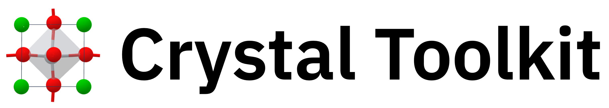

============
Introduction
============

Crystal Toolkit is a web app framework from the `Materials Project <https://materialsproject.org>`_
allowing Python developers to easily make an interactive web app to display materials science information.
As a showcase of the framework's capabilities, the Crystal Toolkit app allows you to import, view, analyze and
transform crystal structures and molecules.

Citation
--------

Crystal Toolkit was created as an academic project to solve specific problems. It is open sourced in the
hopes that it is helpful for others but without guarantee of support.

If you use Crystal Toolkit for your own apps, please cite the Crystal Toolkit publication:

`Horton, Matthew, et al. "Crystal Toolkit: A Web App Framework to Improve Usability and Accessibility of Materials Science Research Algorithms." arXiv preprint arXiv:2302.06147 (2023). <https://arxiv.org/abs/2302.06147>`_

This will help encourage future development and is a nice way to say thank you!

Crystal Toolkit Demonstration App
---------------------------------

The new Materials Project website is powered by the Crystal Toolkit framework, visit it
`here. <https://next-gen.materialsproject.org>`_. This includes the original "Crystal
Toolkit" app `available here <https://next-gen.materialsproject.org/toolkit>`_, which was an app on the
Materials Project that gave the Crystal Toolkit library its name.

Crystal Toolkit Web Framework
-----------------------------

Crystal Toolkit is designed as a modular, object-oriented suite of UI components
built upon the `Dash framework by Plotly <https://dash.plot.ly>`_. The Crystal Toolkit web app is just
one example of using these components.

The custom Dash components developed for use by Crystal Toolkit are available at
`dash-mp-components <https://github.com/materialsproject/dash-mp-components>`_, and
powered by our custom React components available at
`mp-react-components <https://github.com/materialsproject/mp-react-components>`_. These
can be explored interactively in our
`Storybook <https://materialsproject.github.io/mp-react-components/?path=/story/introduction-mp-react-components--page>`_.
These components can also be installed and used independently of Crystal Toolkit.

Installation
------------

You can ``pip install crystal-toolkit``.

For Jupyter integration, please see the `additional installation steps <jupyter>`_.

Modernization
-------------

Please see the `Modernization <>`_ page for more information on how Crystal Toolkit is changing
due to the availability of new features in Dash. The required minimum version is now Dash 2.11.

Development Team
----------------

Crystal Toolkit is the result of the combined efforts of the `Crystal Toolkit Development Team <https://github.com/materialsproject/crystaltoolkit/graphs/contributors>`_.
It was created by `Matthew Horton <https://github.com/mkhorton>`_.

More information on individual contributions can be seen in the `GitHub README <https://github.com/materialsproject/crystaltoolkit#team-and-contribution-policy>`_ and
the associated publication.

New contributors are welcome, please see our `Code of Conduct. <https://github.com/materialsproject/crystaltoolkit/blob/master/code-of-conduct.md>`_
